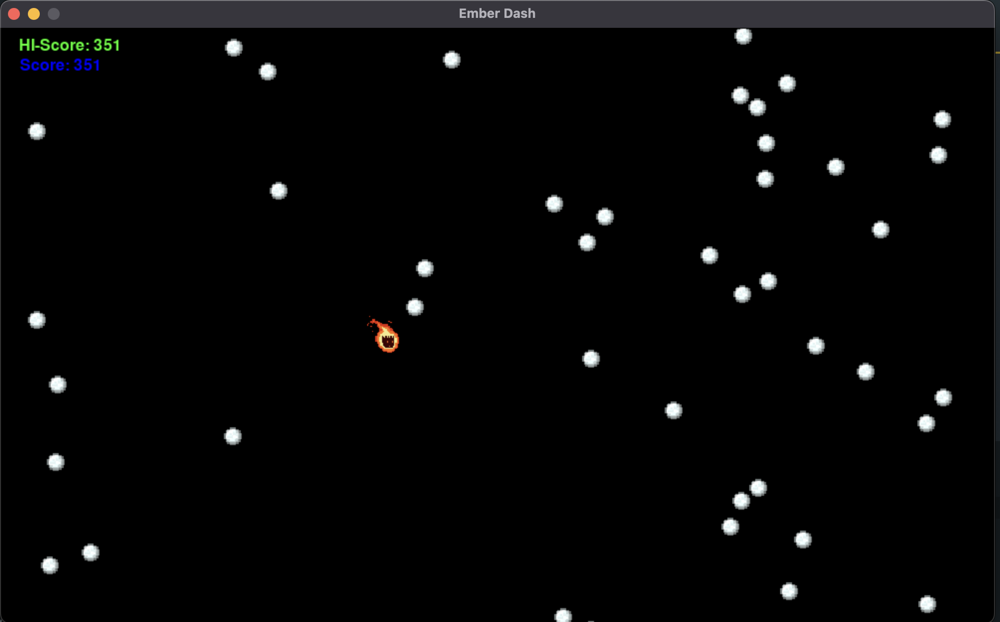

# Ember Dash
bullet hell pygame school project i made in 2023



## Run
```bash
pip3 install pygame
```

## Assets used
- [Player sprite (Wispy)](https://ramenphysics22.itch.io/fire-wisp)
- [Snowballs](https://minecraft.net)